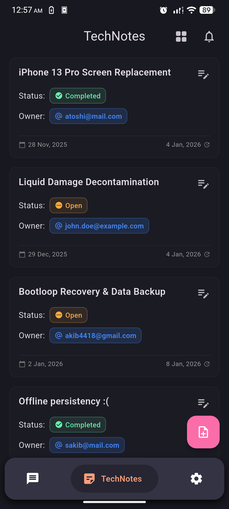
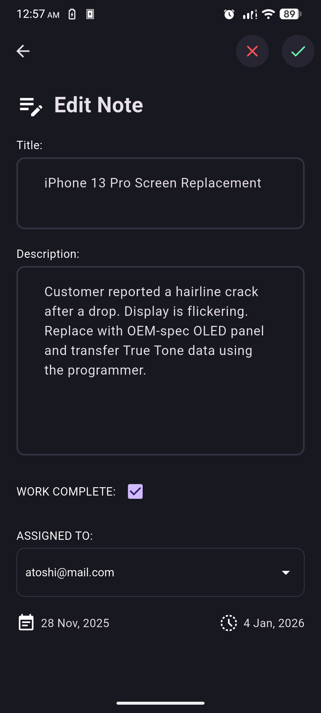
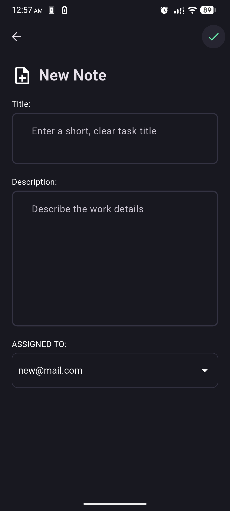
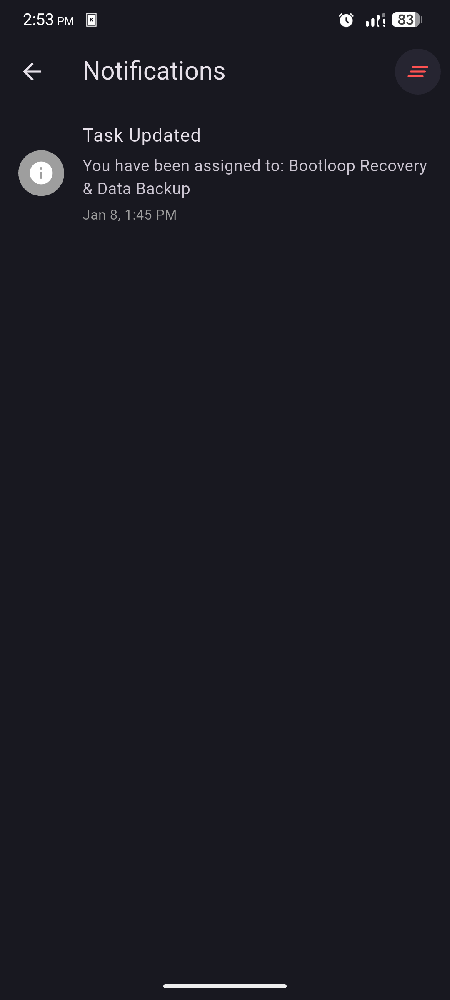
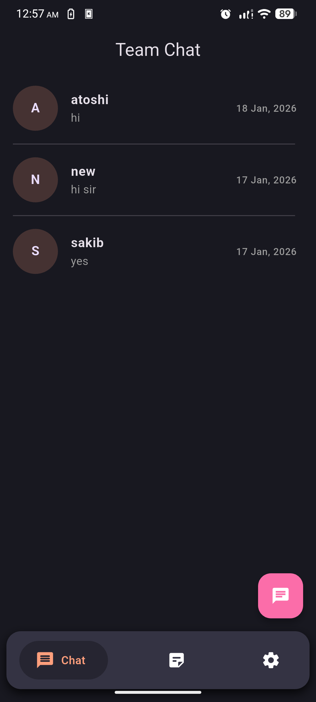
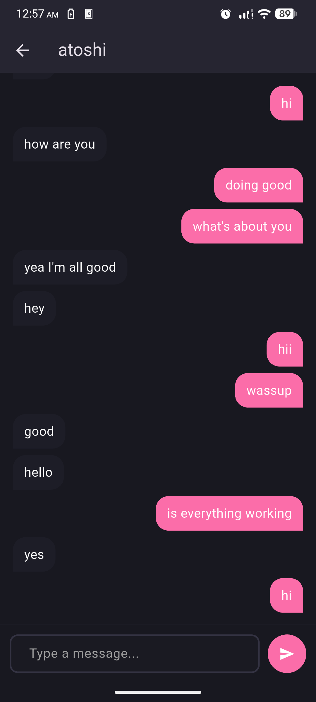
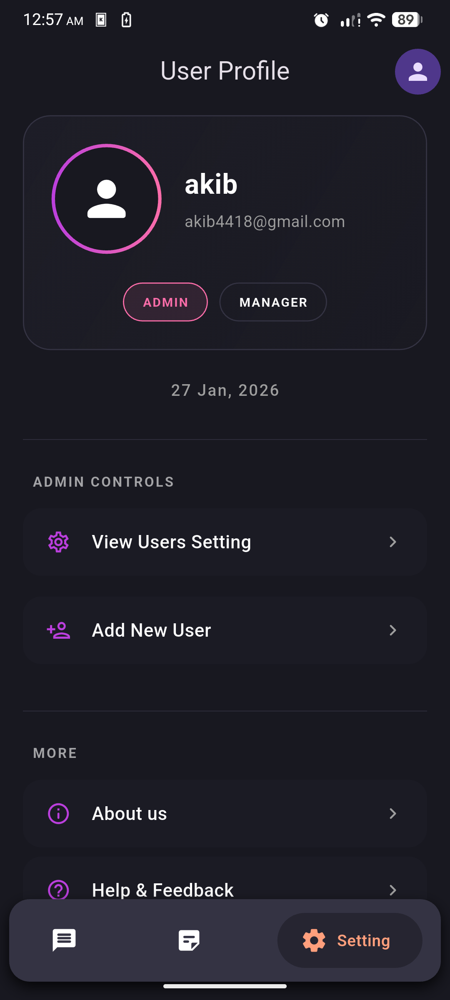
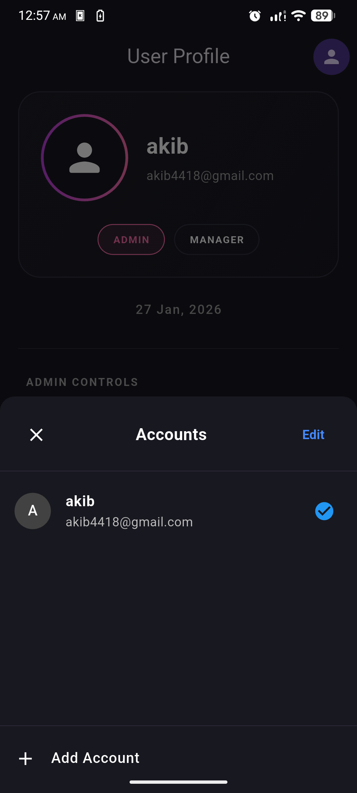
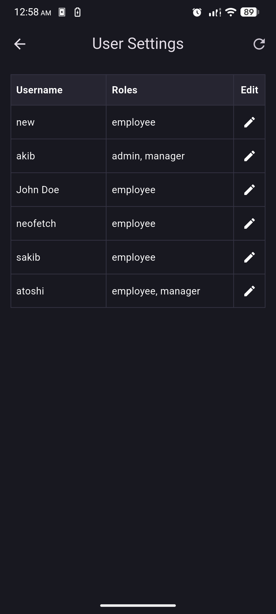
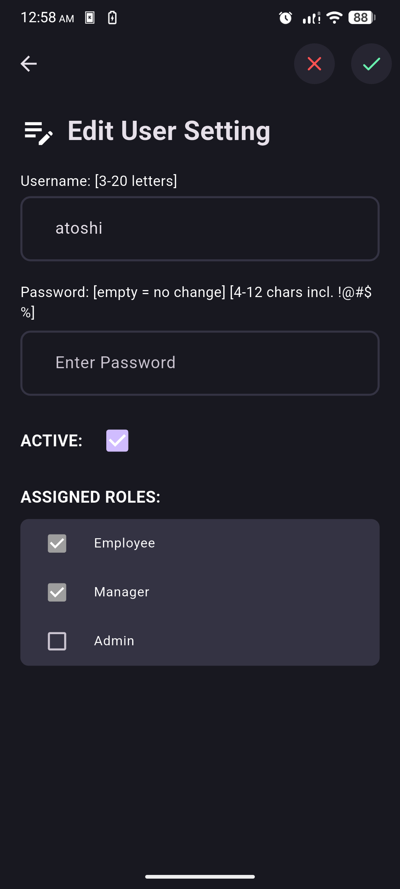

# 🚀 RepairShop — Flutter App

**RepairShop** is a hybrid mobile application built using **Flutter Clean Architecture**, designed for managing repair tasks and team collaboration in a repair shop environment. It supports multiple user roles including **Admin**, **Manager**, and **Employee** — each with distinct responsibilities.

This README covers the **frontend** portion of the app, built entirely using **Flutter**.

---

<details>
<summary><b>Click to expand Current App Previews</b></summary>

<h2 align="center"> Current App Preview </h2>

|                                               |                                                |
| :-------------------------------------------: | :--------------------------------------------: |
|  |   |
|  |  |
|  |   |
|  |   |
|  |   |

</details>

## 🧠 App Architecture

The project follows **Flutter Clean Architecture** principles with a clear separation of concerns:

```

lib
├── core # App-wide utilities, themes, error handling, and shared logic
├── features # Feature-specific folders (auth, tasks, techNotes)
├── init_dependencies.dart
└── main.dart

```

### ✅ Layered Breakdown

- **Core Layer:**
  Contains common utilities, theming, networking, error models, and cubits used globally.

- **Feature Layer:**
  Divided by feature domain:
  - `auth` — Login, signup, and user state management
  - `task` — Task assignment, listing, and status updates
  - `techNotes` — Notes related to repairs and technical details

---

## 👥 User Roles

- **Admin:** Can create other users (admin, manager, employee).
- **Manager:** Can assign tasks to employees and create users (excluding admin).
- **Employee:** Can view and add tasks and notes, and receive assignments.

---

## 📦 Dependencies

Here are the major dependencies powering the app:

| Package                            | Purpose                          |
| ---------------------------------- | -------------------------------- |
| `http`                             | API calls                        |
| `flutter_bloc`                     | State management                 |
| `get_it`                           | Dependency injection             |
| `uuid`                             | Unique ID generation             |
| `intl`                             | Date formatting and localization |
| `internet_connection_checker_plus` | Internet connectivity checks     |
| `fpdart`                           | Functional programming support   |
| `path`                             | File path manipulation           |
| `shared_preferences`               | Local key-value storage          |
| `sqflite`                          | SQLite local database            |

---

## 🎨 Features

- ✅ Authentication (Login/Signup)
- ✅ Role-based user handling
- ✅ Task assignment and tracking
- ✅ Tech note creation
- ✅ Persistent login with SharedPreferences
- ✅ Offline task support with Sqflite
- ✅ Internet connectivity handling
- ✅ Clean architecture structure

---

## 🌙 Theming

- Dark and Light Mode supported
- Easily extendable via `core/theme`

---

## 🔔 Future Enhancements

> Here's what's planned for the next iterations:

- [ ] Push Notifications (for task assignments to employees)
- [ ] Profile management
- [ ] In-app role-based access control
- [ ] Detailed reporting & analytics
- [ ] Cloud sync with backend

---

## 📁 Project Setup

To get started:

```bash
git clone https://github.com/your-org/repairshop-app.git
cd repairshop-app
flutter pub get
flutter run
```

---

## 🤝 Contributing

We welcome community contributions! Please open issues or submit PRs if you spot a bug or want to suggest an enhancement.

---

## 📃 License

This project is licensed under the [MIT License](LICENSE).

---

## 👨‍💻 Author

**Akib Ahmed** — _Software Engineer & Final Year Project Contributor_
Feel free to connect or collaborate!
